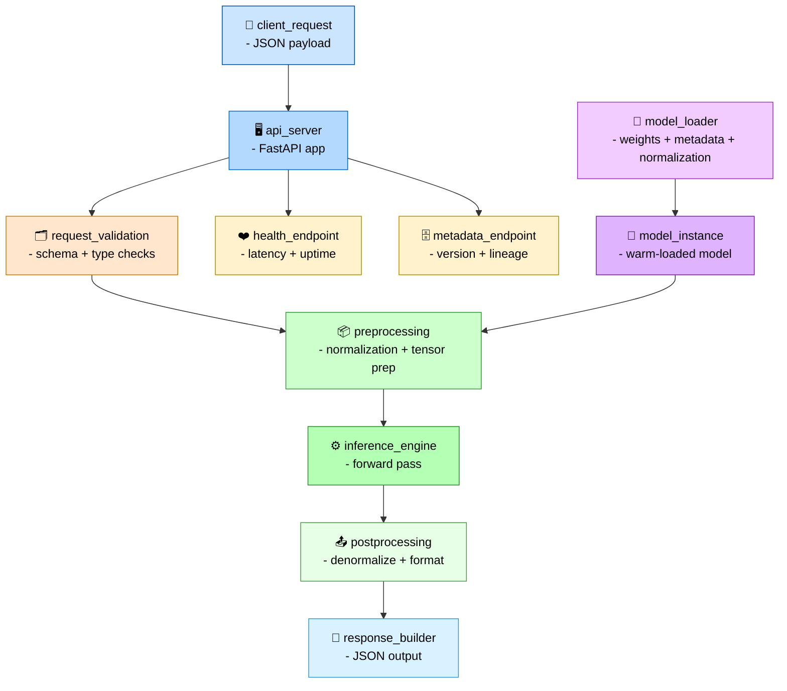

# API Flow Diagram (Inference Server Architecture)

This diagram shows how your FastAPI inference server loads IR₈ deployment artifacts, validates requests, runs inference, and returns structured predictions.



---

## Responsibilities

### API Server

- Load model artifacts, normalization rules, and inference configuration.
- Expose `/predict`, `/health`, and `/metadata` endpoints.
- Manage request parsing, validation, and error handling.

### Request Validation

- Validate JSON payload structure.
- Enforce schema constraints for inputs.
- Reject malformed or incomplete requests.

### Model Loader

- Load model weights and metadata from IR₈ artifacts.
- Apply normalization rules and preprocessing steps.
- Maintain warm model instance for low‑latency inference.

### Inference Engine

- Run forward pass using normalized inputs.
- Apply post‑processing to predictions.
- Produce structured outputs for API response.

### Response Builder

- Format predictions into JSON response.
- Attach metadata, timestamps, and version info.
- Ensure consistent response schema across deployments.

### Health & Metadata Endpoints

- Report model version, registry lineage, and readiness.
- Provide latency, uptime, and environment diagnostics.

---

## Outputs

### API Endpoints

```code
/predict
/health
/metadata
```

### Inference Artifacts

```code
deployment/<model_id>/api/
```

### Logs

```code
data/logs/api/
```

### IR Boundary

- API consumes **IR₈** deployment artifacts and serves production inference.
