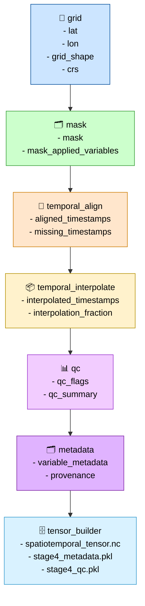

# Compiler Contract Graph (Stage 04)

This diagram shows how each compiler pass in Stage 04 produces a **contract** that becomes the required input for the next pass.
It is the core of the spatiotemporal compiler architecture.



---

## Responsibilities

### grid

- Normalize latitude and longitude arrays.
- Validate CRS and grid spacing.
- Produce the **grid contract**:
  - `lat[]`
  - `lon[]`
  - `grid_shape`
  - `crs`

### mask

- Detect spatial holes.
- Build boolean mask array.
- Apply mask to variables.
- Produce the **mask contract**:
  - `mask[]`
  - `mask_applied_variables`

### temporal_align

- Build aligned timeline.
- Detect missing timestamps.
- Enforce hourly frequency.
- Produce the **alignment contract**:
  - `aligned_timestamps[]`
  - `missing_timestamps[]`

### temporal_interpolate

- Fill temporal gaps.
- Compute interpolation fractions.
- Produce the **interpolation contract**:
  - `interpolated_timestamps[]`
  - `interpolation_fraction[]`

### qc

- Physical range checks.
- NaN/inf detection.
- Temporal/spatial jump checks.
- Produce the **QC contract**:
  - `qc_flags`
  - `qc_summary`

### metadata

- Validate schema and units.
- Propagate provenance.
- Produce the **metadata contract**:
  - `variable_metadata`
  - `provenance`

### tensor_builder

- Apply all contracts (grid, mask, temporal, QC, metadata).
- Build canonical tensor.
- Write final artifacts:

```code
data/spatiotemporal/spatiotemporal_tensor.nc
data/spatiotemporal/stage4_metadata.pkl
data/spatiotemporal/stage4_qc.pkl
```

---

## Outputs

### Compiler Outputs (IR₄)

```code
data/spatiotemporal/spatiotemporal_tensor.nc
data/spatiotemporal/stage4_metadata.pkl
data/spatiotemporal/stage4_qc.pkl
```

### IR Boundary

- Defines **IR₄** (canonical spatiotemporal tensor)
