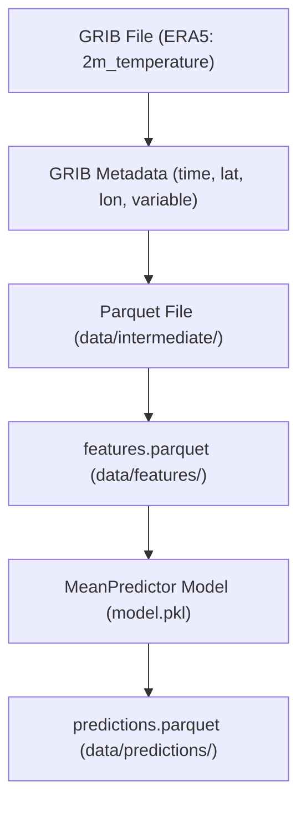

# ERA5 Pollution‑Risk Pipeline — Branch 1

## Data Flow Overview (GRIB → Parquet → Features → Model → Predictions)

---

## Artifact Summary

### Raw ERA5 (GRIB)

- Downloaded via `cdsapi`
- Contains:
  - variable: `t2m`
  - dimensions: time × latitude × longitude
  - GRIB metadata (`shortName`, `units`, `typeOfLevel`, etc.)

### Intermediate Parquet

- Output of GRIB → Parquet conversion
- Flattened tabular structure:
  - `time`
  - `latitude`
  - `longitude`
  - `t2m`

### Features

- Minimal Branch 1 feature registry
- Identity transformation
- Output: `features.parquet`

### Model Artifact

- Baseline `MeanPredictor`
- Stored as `model.pkl`
- Deterministic, import‑safe, pickle‑compatible

### Predictions

- Deterministic predictions
- Stored as `predictions.parquet`
- Includes:
  - `prediction`
  - `actual`
  - `error`

---

## Notes

- Branch 1 is **single‑variable** and intentionally minimal.
- No multi‑variable batching, metadata registry, or transformation graphs yet.
- Branch 2 will expand this diagram significantly.
