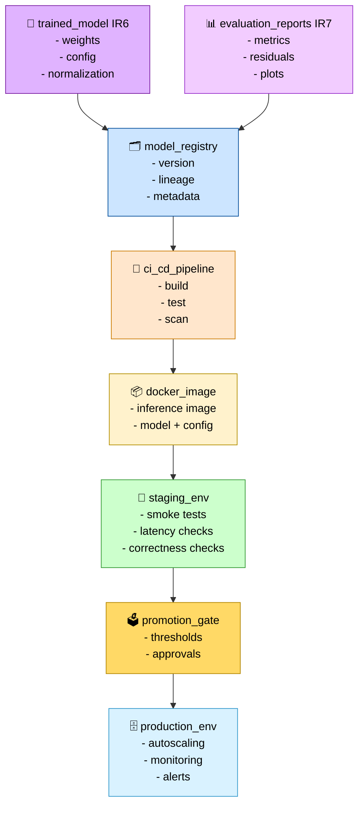

# Deployment Promotion Flow (Stage 08)

This diagram shows how a model moves from **training → registry → staging → smoke tests → production**, completing the IR₈ deployment lifecycle.



---

## Responsibilities

### Model Registry

- Store model version, lineage, metadata, and evaluation summary.
- Provide promotion‑ready artifacts for CI/CD.

### CI/CD Pipeline

- Build inference image.
- Run unit tests and integration tests.
- Perform security scans.
- Push image to container registry.

### Docker Image

- Package model + normalization + inference config.
- Provide CPU/GPU variants.
- Serve as deployable inference unit.

### Staging Environment

- Run smoke tests:
  - latency checks
  - correctness checks
  - schema validation
- Validate inference endpoints.

### Promotion Gate

- Enforce thresholds:
  - accuracy
  - latency
  - stability
- Require approvals for production promotion.

### Production Environment

- Autoscale inference.
- Monitor latency, throughput, and error rates.
- Emit alerts and logs for observability.

---

## Outputs

### Staging Deployment (IR₈)

```code
deployment/staging/
```

### Production Deployment (IR₈)

```code
deployment/production/
```

### Docker Images (IR₈)

```code
docker/<model_id>/
```

### Registry Entries (IR₈)

```code
mlflow/<model_id>/
```

### IR Boundary

- Defines **IR₈** (production‑ready deployment artifacts)
