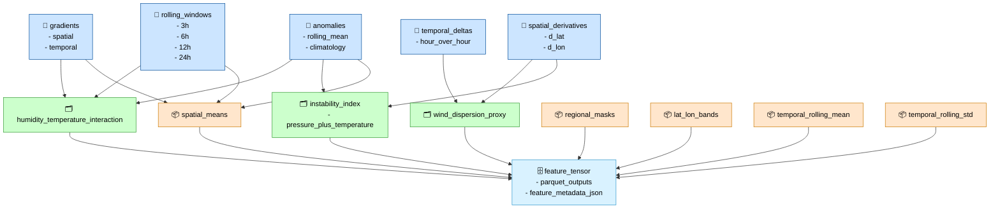

# Feature Registry DAG (Stage 05)

This diagram shows how Stage 05’s feature engineering system builds **derived features**, **composites**, and **aggregations**, and how each of them flows into the final feature tensor set (IR₅).
It is the core DAG for the feature registry.



---

## Responsibilities

### Derived Features

- Compute variable‑specific transformations:
  - gradients (spatial + temporal)
  - anomalies (rolling mean or climatology)
  - rolling windows (3h, 6h, 12h, 24h)
  - temporal deltas (hour‑over‑hour)
  - spatial derivatives (∂/∂lat, ∂/∂lon)
- Normalize units and ensure consistent dtype.
- Register each derived feature with:
  - name
  - description
  - units
  - dependencies

### Composites

- Build multi‑variable composites:
  - humidity × temperature interactions
  - wind × pollutant dispersion proxies
  - pressure + temperature instability indices
- Ensure composite definitions are versioned and reproducible.
- Register composite features with full provenance.

### Aggregations

- Spatial aggregations:
  - grid‑cell means
  - regional masks
  - lat/lon band summaries
- Temporal aggregations:
  - rolling mean
  - rolling std
- Register aggregated features with dependency graphs.

### Feature Tensor Builder

- Combine derived features, composites, and aggregations.
- Align all features to the canonical spatiotemporal grid.
- Write feature tensors and metadata:

```code
data/features/<feature_name>_<timestamp>.parquet
feature_metadata.json
```

---

## Outputs

### Feature Tensors (IR₅)

```code
data/features/<feature_name>_<timestamp>.parquet
```

### Feature Metadata

```code
feature_metadata.json
```

### IR Boundary

- Defines **IR₅** (feature tensors)
