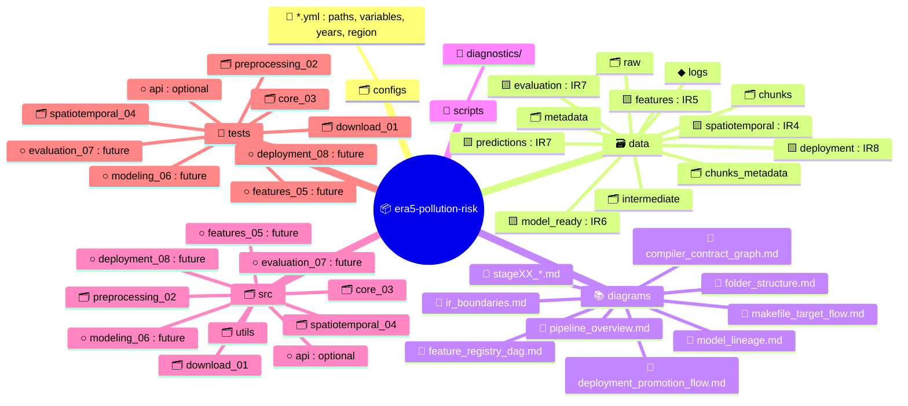

# Folder Structure Diagram (Full Pipeline Architecture)

This diagram shows the complete, stage‑aligned, IR‑aligned folder structure for the ERA5 Pollution Risk pipeline — including current and future modules (Stages 05–08).



---

## Responsibilities

### configs/

- Centralized configuration for paths, variables, years, and regions.
- Ensures reproducible pipeline runs across all stages.

### data/

- IR‑aligned storage for every pipeline stage:
  - IR₀ raw → IR₄ spatiotemporal → IR₅ features → IR₆ model_ready → IR₇ evaluation/predictions → IR₈ deployment.
- Stores logs, metadata, chunk engine outputs, and intermediate artifacts.

### diagrams/

- Complete documentation set for pipeline, stages, IR boundaries, compiler, features, modeling, deployment, Makefile, and folder structure.

### docs/

- Extended documentation, notebooks, and references for contributors and maintainers.

### models/

- Trained model artifacts, metadata, lineage, and versioning.

### scripts/

- Diagnostics and CLI utilities supporting development and debugging workflows.

### src/

- Stage‑aligned code modules:
  - download_01 → preprocessing_02 → core_03 → spatiotemporal_04 → features_05 → modeling_06 → evaluation_07 → deployment_08.
- Optional api/ module for FastAPI inference server.
- utils/ for shared helpers and common utilities.

### tests/

- Mirrors src/ to ensure full coverage and reproducibility across all stages.

---

## Outputs

### IR Artifacts

```code
data/spatiotemporal/ (IR₄)
data/features/ (IR₅)
data/model_ready/ (IR₆)
data/evaluation/ (IR₇)
data/predictions/ (IR₇)
data/deployment/ (IR₈)
```

### Diagrams

```code
diagrams/*.md
```

### Models

```code
models/<model_id>/
```

### Deployment

```code
deployment/staging/
deployment/production/
```

### IR Boundary

- Folder structure aligns with **IR₀ → IR₈** end‑to‑end.
