# IR Boundaries — ERA5 Pollution Risk Pipeline (IR₀ → IR₈)

The ERA5 pipeline is a compiler‑style system defined by its **Intermediate Representations (IRs)**.
Each IR marks a stable, deterministic boundary between pipeline stages.

This document describes all IRs from raw GRIB (IR₀) through deployment artifacts (IR₈).

```mermaid
flowchart LR

    %% Functional IR color scheme
    classDef ir0 fill:#D9D9D9,stroke:#A6A6A6,color:#000;
    classDef ir1 fill:#A7C7E7,stroke:#7AA6D9,color:#000;
    classDef ir2 fill:#7FD1B9,stroke:#5BB89C,color:#000;
    classDef ir3 fill:#8FD18C,stroke:#6FBF6B,color:#000;
    classDef ir4 fill:#FFCC99,stroke:#CC9966,color:#000;
    classDef ir5 fill:#F2C94C,stroke:#D4A72F,color:#000;
    classDef ir6 fill:#C8A2C8,stroke:#A67FB0,color:#000;
    classDef ir7 fill:#F28B82,stroke:#D96F66,color:#000;
    classDef ir8 fill:#A0AEC0,stroke:#7B8899,color:#000;

    IR0[📄 IR0 -- Raw ERA5 GRIB<br>Stage 01<br><br>- GRIB files<br>- ZIP extraction<br>- Raw grids<br><br>data/raw/]:::ir0
    IR1[📄 IR1 -- Hourly Parquet<br>Stage 02<br><br>- Hourly parquet<br>- metadata.json<br><br>data/intermediate/<br>data/metadata/]:::ir1
    IR2[📄 IR2 -- Chunked Tiles<br>Stage 03 Worker<br><br>- Chunk parquet<br>- Chunk metadata<br><br>data/chunks/<br>data/chunks_metadata/]:::ir2
    IR3[📄 IR3 -- merged.nc and QC<br>Stage 03 Merge<br><br>- Unified dataset<br>- QC report<br><br>data/intermediate/]:::ir3
    IR4[📄 IR4 -- Spatiotemporal Tensor<br>Stage 04<br><br>- Canonical tensor<br>- Stage 4 contracts<br><br>data/spatiotemporal/]:::ir4
    IR5[📄 IR5 -- Feature Tensors<br>Stage 05 Planned<br><br>- Derived features<br>- Rolling windows<br><br>data/features/]:::ir5
    IR6[📄 IR6 -- Model Ready Datasets<br>Stage 06 Planned<br><br>- Train/val/test<br>- Normalized datasets<br><br>data/datasets/<br>models/]:::ir6
    IR7[📄 IR7 -- Predictions and Eval<br>Stage 07 Planned<br><br>- Predictions<br>- Metrics<br><br>data/predictions/<br>evaluation_reports/]:::ir7
    IR8[📄 IR8 -- Deployment Artifacts<br>Stage 08 Planned<br><br>- Docker images<br>- FastAPI server<br><br>deployment/<br>docker/<br>api/]:::ir8

    IR0 -->|GRIB -> Parquet| IR1
    IR1 -->|metadata.json -> ChunkSpecs| IR2
    IR2 -->|merge -> merged.nc| IR3
    IR3 -->|compiler passes| IR4
    IR4 -->|feature engineering| IR5
    IR5 -->|dataset assembly| IR6
    IR6 -->|evaluation and inference| IR7
    IR7 -->|deployment| IR8
```

---

## IR Definitions

### IR₀ — Raw ERA5 GRIB

- Multi‑variable GRIB files from ECMWF
- Raw coordinate grids
- `.idx` index files
- **Source:** Stage 01 (Ingestion)

### IR₁ — Hourly Parquet + metadata.json

- HOURLY Parquet slices for each variable
- Unified GRIB inspection metadata
- Global `metadata.json` mapping variables → timestamps → parquet paths
- **Source:** Stage 02 (Preprocessing)

### IR₂ — Chunked Parquet Tiles

- Schema‑normalized chunk parquet files
- Per‑chunk metadata
- **Source:** Stage 03 (Chunk Workers)

### IR₃ — merged.nc + merged_metadata.json + merged_qc.json

- Unified multi‑variable dataset
- Merged QC report
- Merged metadata
- **Source:** Stage 03 (Chunk Merge)

### IR₄ — Spatiotemporal Tensor + Stage 4 Contracts

- Canonical spatiotemporal tensor
- Grid, mask, temporal, QC, and metadata contracts
- **Source:** Stage 04 (Spatiotemporal Compiler)

### IR₅ — Feature Tensors (Planned)

- Derived meteorological features
- Pollution‑risk composites
- Rolling windows, anomalies, gradients
- **Source:** Stage 05 (Feature Engineering)

### IR₆ — Model‑Ready Datasets + Artifacts (Planned)

- Train/val/test splits
- Normalized datasets
- Model manifests and versioned artifacts
- **Source:** Stage 06 (Modeling)

### IR₇ — Predictions + Evaluation Artifacts (Planned)

- Predictions
- Regression metrics
- Residuals and diagnostics
- Plots
- **Source:** Stage 07 (Evaluation)

### IR₈ — Deployment Artifacts (Planned)

- Model registry entries
- Docker images
- FastAPI inference server
- CI/CD manifests
- Batch and online inference endpoints
- **Source:** Stage 08 (Deployment)
