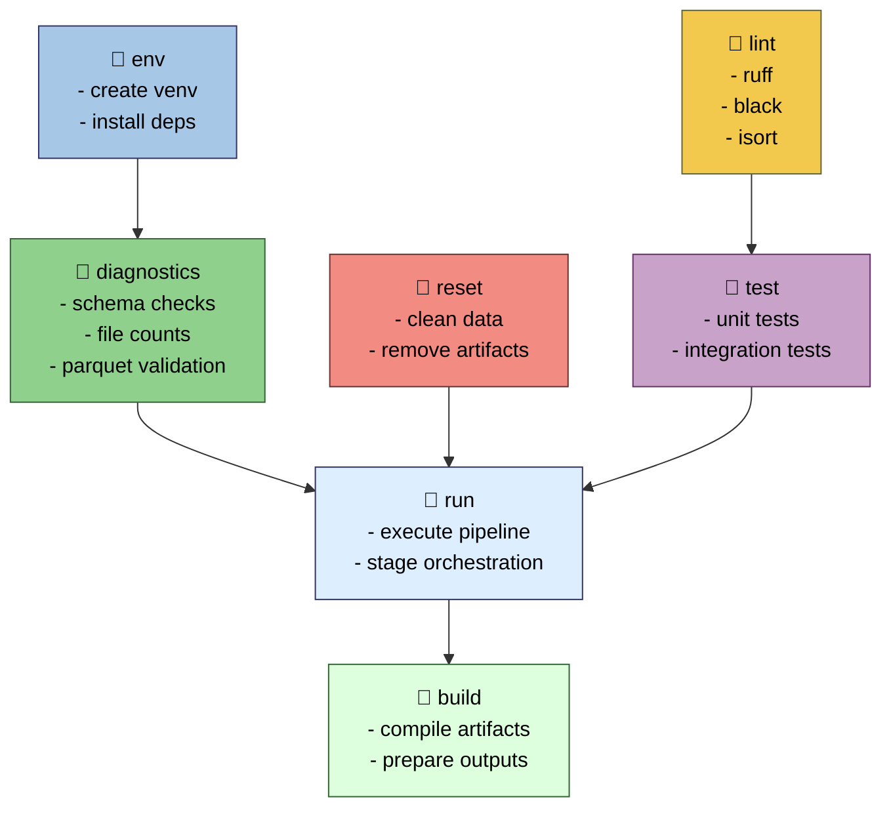

# Makefile Target Flow Diagram

This diagram shows how your Makefile orchestrates environment setup, diagnostics, linting, testing, data resets, and pipeline execution.
It is the developer‑workflow counterpart to your pipeline + IR diagrams.



---

## Responsibilities

### env

- Create virtual environment.
- Install pinned dependencies.
- Validate toolchain availability.

### reset

- Remove intermediate data.
- Clear artifacts and logs.
- Ensure reproducible pipeline runs.

### diagnostics

- Validate input schemas.
- Count rows, columns, timestamps.
- Check parquet integrity and metadata.

### lint

- Run ruff, black, and isort.
- Enforce formatting and style consistency.

### test

- Execute unit tests.
- Run integration tests.
- Validate pipeline correctness.

### run

- Execute pipeline stages.
- Orchestrate IR₀ → IR₈ transitions.
- Produce intermediate and final artifacts.

### build

- Compile final outputs.
- Prepare deployment artifacts.
- Ensure reproducibility and versioning.

---

## Outputs

### Build Artifacts

```code
build/
```

### Logs

```code
logs/
```

### Intermediate Data

```code
data/intermediate/
```

### Final Outputs

```code
data/final/
```

### IR Boundary

- Makefile orchestrates transitions across **IR₀ → IR₈**
