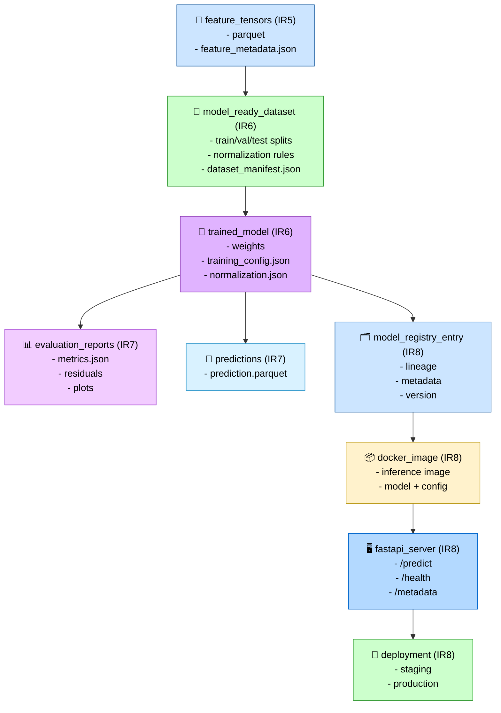

# Model Lineage Diagram (Stages 06–08)

This diagram shows how datasets, features, models, evaluations, registry entries, and deployment artifacts connect across Stages 06–08.
It is the end‑to‑end lineage graph for the modeling + deployment pipeline.



---

## Responsibilities

### Feature Tensors (IR₅)

- Provide all derived features, composites, and aggregations.
- Supply canonical feature metadata.
- Serve as the sole input to dataset assembly.

### Model‑Ready Dataset (IR₆)

- Build deterministic train/val/test splits.
- Apply normalization rules.
- Produce dataset manifest for reproducibility.

### Trained Model (IR₆)

- Store weights, training config, and normalization rules.
- Capture dataset lineage.
- Produce artifacts for evaluation and registry.

### Evaluation Reports (IR₇)

- Compute regression metrics (MAE, RMSE, R², MAPE).
- Generate residuals, plots, calibration curves.
- Provide model quality signals for promotion.

### Predictions (IR₇)

- Batch inference over full datasets.
- Produce prediction parquet files.

### Model Registry Entry (IR₈)

- Store lineage, metadata, version, and artifacts.
- Track promotion from staging → production.

### Docker Image (IR₈)

- Package model + normalization + inference config.
- Provide CPU/GPU variants.
- Serve as the deployable inference unit.

### FastAPI Server (IR₈)

- Load model and normalization rules.
- Expose `/predict`, `/health`, `/metadata`.
- Provide batch + streaming inference.

### Deployment (IR₈)

- Run staging and production environments.
- Autoscale inference.
- Serve predictions to downstream systems.

---

## Outputs

### Model‑Ready Dataset (IR₆)

```code
data/datasets/<dataset_name>.parquet
```

### Model Artifacts (IR₆)

```code
models/<model_id>/artifacts/
models/<model_id>/metadata.json
```

### Evaluation Reports (IR₇)

```code
evaluation_reports/<model_id>.json
plots/<model_id>_*.png
```

### Predictions (IR₇)

```code
data/predictions/<model_id>_<timestamp>.parquet
```

### Registry Entry (IR₈)

```code
mlflow/<model_id>/
```

### Docker Image (IR₈)

```code
docker/<model_id>/
```

### FastAPI Server (IR₈)

```code
api/
```

### Deployment (IR₈)

```code
deployment/
```

### IR Boundary

- Defines **IR₆**, **IR₇**, and **IR₈** lineage end‑to‑end
