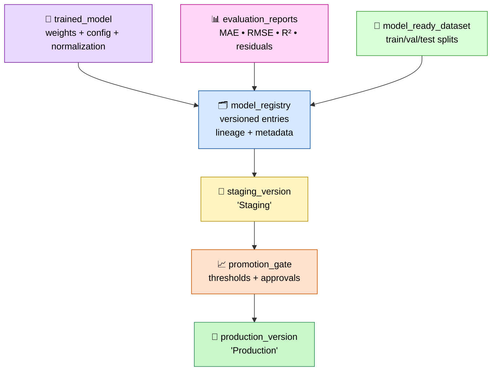

# Model Registry Flow Diagram (MLflow Lineage + Promotion)



---

## Responsibilities

### Model Registry

- Store versioned model entries.
- Capture lineage: dataset hash, feature set, training config.
- Store evaluation summary and metadata.
- Provide artifacts for staging and production.

### Staging Version

- Holds the candidate model for promotion.
- Used for smoke tests, latency checks, correctness validation.
- Allows rollback to previous staging versions.

### Promotion Gate

- Enforces thresholds for accuracy, latency, stability.
- Requires human approval or automated checks.
- Moves model from staging → production.

### Production Version

- Serves live inference.
- Autoscaled and monitored.
- Supports rollback and version pinning.

---

## Outputs

### Registry Entries

```code
mlflow/<model_id>/version-<n>/
```

### Staging Version

```code
mlflow/<model_id>/staging/
```

### Production Version

```code
mlflow/<model_id>/production/
```

### IR Boundary

- Registry manages **IR₈** promotion artifacts end‑to‑end.
