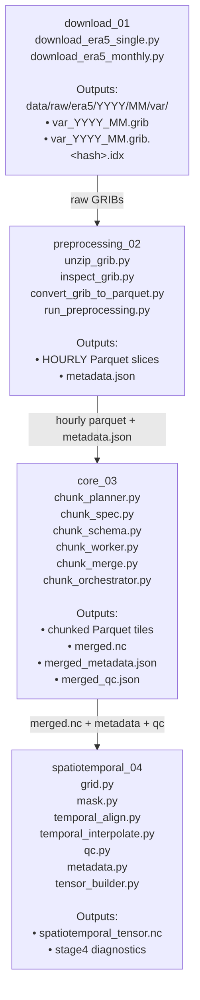

# ERA5 Pipeline — Branch 2 (Stages 1–4)

Branch 2 expands the Branch 1 MVP into a multi‑variable, parallel, chunk‑ready ingestion and spatiotemporal compiler system.

Branch 2 introduces:

- Monthly ZIP + multi‑variable GRIB ingestion
- Unified GRIB inspection (single + multi)
- HOURLY Parquet conversion for all variables
- Parallel preprocessing
- Master `metadata.json` (Stage 2 → Stage 3 contract)
- Chunk‑planning + chunk‑execution engine (Stage 3)
- Fully implemented spatiotemporal compiler (Stage 4)



## Stage Summaries

### Stage 1 — download_01 (GRIB ingestion)

- Branch 1: single‑variable GRIB (compatibility only)
- Branch 2: monthly ZIP + multi‑variable GRIB ingestion
- Produces **per‑variable GRIBs** under:

```code
data/raw/era5/<year>/<month>/<variable>/
    <variable>_<year>_<month>.grib
    <variable>_<year>_<month>.grib.<hash>.idx
```

### Stage 2 — preprocessing_02 (Preprocessing GRIB to Parquet)

- Unzip monthly ZIPs → normalized GRIBs
- Unified inspection (single + multi)
- HOURLY Parquet conversion
- Parallel preprocessing

Outputs:

```code
data/intermediate/<year>/<month>/<variable>/<variable>_<timestamp>.parquet
data/metadata/metadata.json
```

### Stage 3 — core_03 (Chunked Parallel Engine)

Modules:

```code
chunk_spec.py
chunk_schema.py
chunk_planner.py
chunk_worker.py
chunk_merge.py
chunk_orchestrator.py
```

Responsbilities:

- Chunk planning (temporal + spatial)
- Chunk schema definition
- Chunk worker execution (parallel)
- Chunk merging → unified Stage 3 IR

Outputs:

```code
data/chunks/
    chunk_<tile>_<timestamp>.parquet

data/chunks_metadata/
    chunk_<tile>_<timestamp>.json

data/intermediate/
    merged.nc
    merged_metadata.json
    merged_qc.json
```

### Stage 4 — spatiotemporal_04 (Compiler Layer)

Compiler pass order:

1. grid
2. mask
3. temporal_align
4. temporal_interpolate
5. qc
6. metadata
7. tensor_builder

Responsibilities:

- Merge Stage 3 IR into unified spatiotemporal cubes
- Normalize grid + coordinates
- Align + interpolate timestamps
- Propagate QC + metadata
- Build canonical spatiotemporal tensor

Outputs:

```code
data/spatiotemporal/
    spatiotemporal_tensor.nc
    stage4_<diagnostic>.json
```

---

## Forward Plan — Stages 5–8 (Not Yet Implemented)

These stages extend the pipeline beyond ingestion and spatiotemporal structuring.
Stage 4 is implemented; Stages 5–8 are roadmap items.

### Stage 5 — Feature Engineering (Branch 2)

- Derived meteorological features
- Pollution‑risk composites
- Gradients, anomalies, rolling windows
- Spatial aggregations

Output:

```code
data/features/
```

### Stage 6 — Dataset Assembly + Modeling (Branch 2)

- Train/val/test splits
- Normalization
- ML/AI models (regression, transformers, CNNs, time‑series, stochastic models)
- Academic‑paper‑ready datasets

Outputs:

```code
data/datasets/
models/
```

### Stage 7 — Evaluation + Inference (Branch 2)

- Metrics
- Plots
- Predictions
- Backtests

Output:

```code
data/predictions/
```

### Stage 8 — Deployment (Branch 3)

- Docker images
- FastAPI inference server
- MLflow model registry
- CI/CD
- Cloud batch inference + REST endpoints

Outputs:

```code
deployment/
docker/
api/
mlflow/
```
