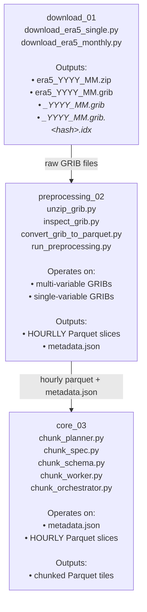

# ERA5 Pipeline — Branch 2 (Stages 1–3)

This diagram shows the current Branch 2 ERA5 pipeline, which expands Branch 1
from a single‑variable MVP into a multi‑variable, parallel, chunk‑ready ingestion
system.

Branch 2 introduces:

- Monthly ZIP + multi‑variable GRIB ingestion
- Unified GRIB inspection (single + multi)
- HOURLY Parquet conversion for all variables
- Parallel preprocessing
- Master metadata.json (Stage 2 → Stage 3 contract)
- Chunk‑planning and chunk‑execution engine (Stage 3)

## Stage Summaries

### Stage 1 — download_01

- Single‑variable GRIB (Branch 1 compatibility)
- Monthly ZIP + multi‑variable GRIB (Branch 2 ingestion)
- Output: raw GRIBs + IDX

### Stage 2 — preprocessing_02

- Unzip monthly ZIPs → normalized GRIBs
- Unified inspection (single + multi)
- HOURLY Parquet conversion
- Parallel preprocessing
- Output: `metadata.json` + hourly Parquet slices

### Stage 3 — core_03

- Chunk planning (temporal + spatial)
- Chunk schema definition
- Chunk worker execution (parallel)
- Output: chunked Parquet tiles

---

## Forward Plan — Stages 4–8 (Not Yet Implemented)

These stages are planned and shape the design of Stage 3. They appear here for
roadmap clarity but are not yet implemented.

### Stage 4 — Spatiotemporal Structuring

- Merge chunked tiles into unified spatiotemporal cubes
- Build multi‑variable tensors
- Output: `structured_04/`

### Stage 5 — Feature Engineering

- Derived features (gradients, anomalies, rolling windows)
- Spatial aggregations
- Output: `features_05/`

### Stage 6 — Dataset Assembly

- Train/val/test splits
- Normalization
- Output: `datasets_06/`

### Stage 7 — Modeling

- ML/AI models (regression, transformers, CNNs)
- Output: `modeling_07/`

### Stage 8 — Evaluation + Inference

- Metrics, plots, predictions
- Output: `predictions_08/`
