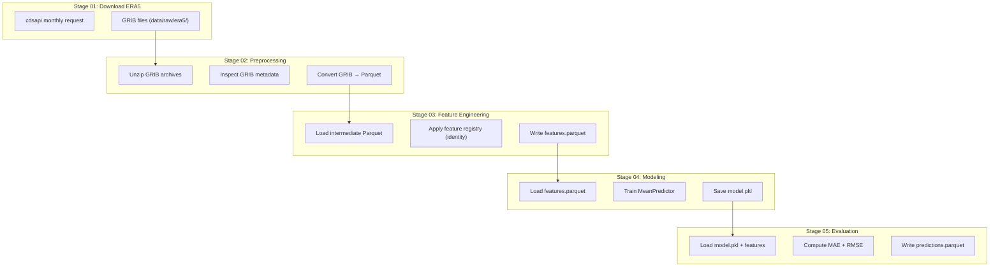

# ERA5 Pollution‑Risk Pipeline — Branch 1

## Pipeline Architecture (Stages 01–05)

## Notes

- Branch 1 is **single‑variable** (2m_temperature) and fully deterministic.
- All stages use shared utilities (`src/utils/`) for logging, paths, config, and validation.
- Raw ERA5 data (`data/raw/era5/`) is never committed to the repository.
