# ERA5 Pollution Risk Pipeline — Branch 2 Overview (Stages 01–08)

This diagram shows the full end‑to‑end ERA5 pipeline as a **compiler‑style system**:

- Raw ERA5 GRIB → structured IRs → spatiotemporal tensors → features → models → evaluation → deployment.
- Each stage is deterministic, config‑driven, and designed for reproducible scientific workflows.

```mermaid
flowchart LR

    S01["📥 Stage 01 — Ingestion
    src/download_01/
    - Monthly ZIP + multi-variable ERA5 download
    - Per-variable GRIB files
    - Raw artifact tracking
    Outputs:
    - data/raw/era5/YYYY/MM/var/*.grib
    - idx files"]:::s01

    S02["🧰 Stage 02 — Preprocessing
    src/preprocessing_02/
    - Unzip GRIBs
    - Inspect GRIB metadata (dims, coords, units)
    - HOURLY Parquet conversion
    - Master metadata.json IR1
    Outputs:
    - intermediate parquet
    - metadata.json"]:::s02

    S03["🧱 Stage 03 — Chunk Engine
    src/core_03/
    - Chunk planning
    - Parallel chunk workers
    - Chunk merge to merged.nc IR3
    - merged_metadata.json and merged_qc.json
    Outputs:
    - chunk parquet
    - chunk metadata
    - merged.nc"]:::s03

    S04["🌐 Stage 04 — Spatiotemporal Compiler
    src/spatiotemporal_04/
    - grid normalization
    - mask consistency
    - temporal alignment
    - temporal interpolation
    - qc checks
    - metadata contracts
    - tensor_builder
    Outputs:
    - spatiotemporal_tensor.nc
    - stage4 metadata and qc"]:::s04

    S05["🧮 Stage 05 — Feature Engineering
    - Derived features
    - Composites
    - Rolling windows
    - Spatial aggregations
    - Feature registry
    Outputs:
    - feature parquet
    - feature metadata"]:::s05

    S06["🤖 Stage 06 — Modeling
    - Train/val/test splits
    - Normalization
    - Model families
    - Hyperparameter search
    - Model versioning
    Outputs:
    - datasets
    - model artifacts"]:::s06

    S07["📊 Stage 07 — Evaluation
    - Regression metrics
    - Residual analysis
    - Calibration curves
    - Error distributions
    - Backtests
    Outputs:
    - predictions
    - evaluation reports
    - plots"]:::s07

    S08["🚀 Stage 08 — Deployment
    - Model registry integration
    - Docker images
    - FastAPI inference server
    - CI/CD pipelines
    - Batch + online inference
    Outputs:
    - deployment artifacts"]:::s08

    S01 -->|raw GRIB + idx| S02
    S02 -->|hourly parquet + metadata IR1| S03
    S03 -->|merged.nc + metadata + qc IR3| S04
    S04 -->|spatiotensor + contracts IR4| S05
    S05 -->|feature tensors IR5| S06
    S06 -->|datasets + models IR6| S07
    S07 -->|predictions + eval IR7| S08

    classDef s01 fill:#e6f2ff,stroke:#004c99,color:#000;
    classDef s02 fill:#e8ffe8,stroke:#339933,color:#000;
    classDef s03 fill:#fff0e6,stroke:#cc5500,color:#000;
    classDef s04 fill:#f2e6ff,stroke:#7a1fa2,color:#000;
    classDef s05 fill:#fffbe6,stroke:#b38f00,color:#000;
    classDef s06 fill:#e6f7ff,stroke:#0066cc,color:#000;
    classDef s07 fill:#ffe6f7,stroke:#cc3399,color:#000;
    classDef s08 fill:#e6ffe6,stroke:#339933,color:#000;
```

---

## Stage Overview

### Stage 01 — Ingestion (`download_01`)

- Multi‑variable ERA5 ingestion (monthly ZIPs)
- Per‑variable GRIB extraction
- Raw artifact tracking
- **Output (IR₀):**
  - `data/raw/era5/<year>/<month>/<variable>/*.grib`
  - `*.idx` index files

### Stage 02 — Preprocessing (`preprocessing_02`)

- Unzip GRIBs
- Unified GRIB inspection (dims, coords, units)
- HOURLY Parquet conversion
- Master `metadata.json` (global IR₁ contract)
- **Output (IR₁):**
  - `data/intermediate/<year>/<month>/<variable>/*.parquet`
  - `data/metadata/metadata.json`

### Stage 03 — Chunk Engine (`core_03`)

- Chunk planning (temporal windows, variables)
- Chunk specification (ChunkSpec)
- Parallel chunk workers
- Chunk merge → `merged.nc`
- `merged_metadata.json` + `merged_qc.json`
- **Output (IR₂ + IR₃):**
  - `data/chunks/chunk_<tile>_<timestamp>.parquet`
  - `data/chunks_metadata/chunk_<tile>_<timestamp>.json`
  - `data/intermediate/merged.nc`
  - `merged_metadata.json`
  - `merged_qc.json`

### Stage 04 — Spatiotemporal Compiler (`spatiotemporal_04`)

Compiler passes:

1. grid (lat/lon normalization)
2. mask (spatial consistency)
3. temporal_align (aligned timeline)
4. temporal_interpolate (gap filling)
5. qc (physical + numeric checks)
6. metadata (contracts)
7. tensor_builder (canonical tensor)

- **Output (IR₄):**
  - `data/spatiotemporal/spatiotemporal_tensor.nc`
  - `stage4_metadata.pkl`
  - `stage4_qc.pkl`
  - `stage4_<diagnostic>.json`

### Stage 05 — Feature Engineering (Planned)

- Derived meteorological features
- Pollution‑risk composites
- Rolling windows, anomalies, gradients
- Spatial aggregations
- Feature registry + provenance
- **Output (IR₅):**
  - `data/features/*.parquet`
  - `feature_metadata.json`

### Stage 06 — Dataset Assembly + Modeling (Planned)

- Train/val/test splits
- Normalization + scaling
- Model families:
  - GBMs (XGBoost/LightGBM)
  - CNNs / U‑Nets (spatial)
  - Transformers (temporal)
  - Spatiotemporal hybrids
- Hyperparameter search
- Model versioning + manifests
- **Output (IR₆):**
  - `data/datasets/*.parquet`
  - `models/<model_id>/artifacts`
  - `models/<model_id>/metadata.json`

### Stage 07 — Evaluation + Inference (Planned)

- Regression metrics (MAE, RMSE, R², MAPE)
- Residual analysis
- Calibration curves
- Error distributions
- Backtests
- Batch inference
- **Output (IR₇):**
  - `data/predictions/*.parquet`
  - `evaluation_reports/*.json`
  - `plots/*.png`

### Stage 08 — Deployment (Planned)

- Model registry integration (MLflow)
- Docker images
- FastAPI inference server
- CI/CD pipelines
- Batch + online inference endpoints
- Artifact versioning
- **Output (IR₈):**
  - `deployment/`
  - `docker/`
  - `api/`
  - `mlflow/`
  - Infrastructure manifests
