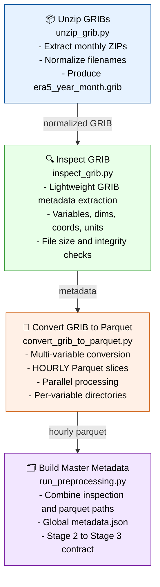

# Stage 02 — Preprocessing (GRIB → Hourly Parquet)

Stage 02 converts raw ERA5 GRIB files into structured, hourly Parquet slices and produces the global metadata.json used by Stage 03.



---

## Responsibilities

### 1. Unzip GRIBs

- Extract monthly ZIP archives from Stage 01.
- Normalize filenames to a consistent pattern:

```code
era5_<year>_<month>.grib
```

- Validate ZIP integrity and GRIB presence.

### 2. Inspect GRIB

- Extract variable list (shortName, long_name, units).
- Extract dimensions and coordinate grids.
- Validate GRIB structure before conversion.
- Produce lightweight inspection metadata.

### 3. Convert GRIB to Parquet

- Convert all variables in the GRIB file.
- Produce HOURLY Parquet slices:

```code
data/intermediate/<year>/<month>/<variable>/<variable>_<timestamp>.parquet
```

- Parallel conversion for speed.
- Normalize schema:
- `time`
- `lat`
- `lon`
- `<variable>`

### 4. Build Master Metadata

- Combine inspection metadata and parquet paths.
- Produce global `metadata.json`:

```json
{
  "variables": {
    "<shortName>": {
      "<timestamp>": "<parquet_path>"
    }
  },
  "timestamps": [...]
}
```

- Defines the Stage 2 → Stage 3 contract.

---

## Outputs

### Hourly Parquet Slices

```code
data/intermediate/<year>/<month>/<variable>/<variable>_<timestamp>.parquet
```

### Global Metadata

```code
data/metadata/metadata.json
```

### IR Boundary

- Defines **IR₁** (hourly Parquet + metadata.json)
