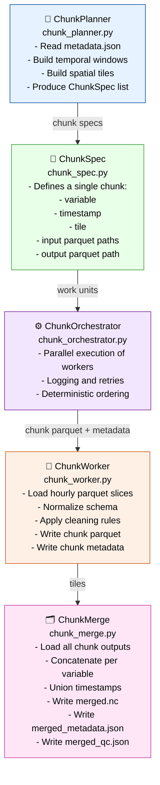

# Stage 03 — Chunk Engine (Parallel Chunking + Merge)

Stage 03 transforms hourly Parquet slices (IR₁) into chunked Parquet tiles (IR₂) and finally into a unified merged dataset (IR₃).
It is the pipeline’s parallel execution layer and the foundation for deterministic spatiotemporal compilation.



---

## Responsibilities

### 1. ChunkPlanner

- Load `metadata.json` from Stage 02.
- Reconstruct nested metadata:
  - variables → timestamps → parquet paths.
- Compute temporal windows:
  - hourly slices → chunk windows.
- Compute spatial tiles:
  - lat/lon grid → tile boundaries.
- Produce a deterministic list of `ChunkSpec` objects.

### 2. ChunkSpec

Defines the full contract for a single chunk:

- `variable`
- `timestamp`
- `tile`
- `input_paths` (hourly parquet slices)
- `output_path` (chunk parquet)
- `metadata_path` (chunk metadata)

### 3. ChunkWorker

- Load hourly parquet slices for the chunk.
- Normalize schema:
  - `time`, `lat`, `lon`, `<variable>`.
- Clean missing or malformed values.
- Apply unit normalization (if needed).
- Write chunk parquet:

```code
data/chunks/chunk_<tile>_<timestamp>.parquet
```

- Write chunk metadata:

```code
data/chunks_metadata/chunk_<tile>_<timestamp>.json
```

### 4. ChunkOrchestrator

- Execute all `ChunkSpec` objects in parallel.
- Deterministic ordering of work units.
- Logging, retries, and error handling.
- Ensures reproducible chunk outputs.

### 5. ChunkMerge

- Load all chunk parquet outputs.
- Concatenate per variable.
- Union timestamps across all tiles.
- Write merged dataset:

```code
data/intermediate/merged.nc
```

- Write merged metadata:

```code
data/intermediate/merged_metadata.json
```

- Write merged QC report:

```code
data/intermediate/merged_qc.json
```

---

## Outputs

### Chunked Parquet Tiles (IR₂)

```code
data/chunks/chunk_<tile>_<timestamp>.parquet
```

### Chunk Metadata (IR₂)

```code
data/chunks_metadata/chunk_<tile>_<timestamp>.json
```

### Merged Dataset (IR₃)

```code
data/intermediate/merged.nc
data/intermediate/merged_metadata.json
data/intermediate/merged_qc.json
```

### IR Boundary

- Defines **IR₂** (chunked tiles)
- Defines **IR₃** (merged dataset)
