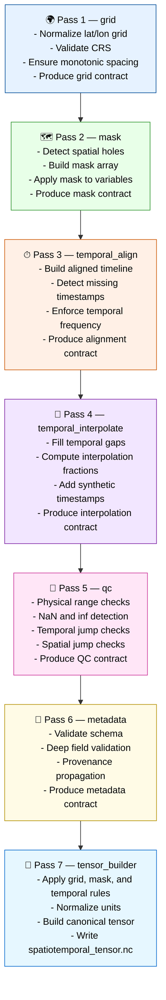

# Stage 04 — Spatiotemporal Compiler (Grid → Mask → Temporal → QC → Tensor)

Stage 04 is the semantic compiler of the ERA5 pipeline.
It transforms the merged Stage 03 dataset (IR₃) into a canonical spatiotemporal tensor (IR₄) through a sequence of deterministic compiler passes.



---

## Responsibilities

### 1. grid

- Normalize latitude and longitude arrays.
- Validate coordinate reference system (CRS).
- Ensure monotonic spacing and consistent grid shape.
- Produce the **grid contract**:
  - `lat[]`
  - `lon[]`
  - `grid_shape`
  - `crs`

### 2. mask

- Detect spatial holes or missing grid cells.
- Build a boolean mask array.
- Apply mask to all variables.
- Produce the **mask contract**:
  - `mask[]`
  - `mask_applied_variables`

### 3. temporal_align

- Build a fully aligned timeline across all variables.
- Detect missing timestamps.
- Enforce temporal frequency (hourly).
- Produce the **alignment contract**:
  - `aligned_timestamps[]`
  - `missing_timestamps[]`

### 4. temporal_interpolate

- Fill temporal gaps using interpolation.
- Compute interpolation fractions.
- Add synthetic timestamps when required.
- Produce the **interpolation contract**:
  - `interpolated_timestamps[]`
  - `interpolation_fraction[]`

### 5. qc

- Physical range checks (variable-specific).
- NaN/inf detection.
- Temporal jump checks.
- Spatial jump checks.
- Produce the **QC contract**:
  - `qc_flags`
  - `qc_summary`

### 6. metadata

- Validate schema consistency.
- Deep field validation (units, long_name, standard_name).
- Propagate provenance.
- Produce the **metadata contract**:
  - `variable_metadata`
  - `provenance`

### 7. tensor_builder

- Apply grid, mask, temporal, QC, and metadata rules.
- Normalize units.
- Build canonical spatiotemporal tensor:
  - dims: `[time, lat, lon, variable]`
- Write final artifacts:

```code
data/spatiotemporal/spatiotemporal_tensor.nc
data/spatiotemporal/stage4_metadata.pkl
data/spatiotemporal/stage4_qc.pkl
data/spatiotemporal/stage4_<diagnostic>.json
```

---

## Outputs

### Spatiotemporal Tensor (IR₄)

```code
data/spatiotemporal/spatiotemporal_tensor.nc
```

### Stage 4 Metadata

```code
data/spatiotemporal/stage4_metadata.pkl
```

### Stage 4 QC Report

```code
data/spatiotemporal/stage4_qc.pkl
```

### Diagnostics

```code
data/spatiotemporal/stage4_<diagnostic>.json
```

### IR Boundary

- Defines **IR₄** (canonical spatiotemporal tensor)
