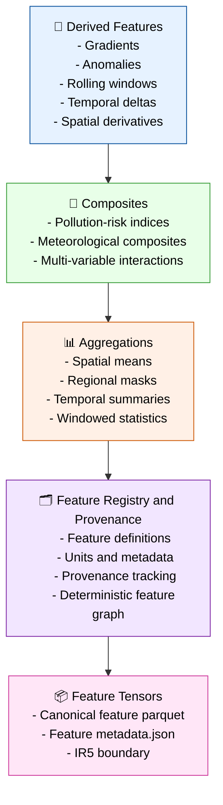

# Stage 05 — Feature Engineering (Derived Features + Composites)

Stage 05 transforms the canonical spatiotemporal tensor (IR₄) into derived feature tensors (IR₅).
This stage introduces modern, staff‑level feature engineering patterns used in atmospheric science, pollution‑risk modeling, and spatiotemporal ML systems.



---

## Responsibilities

### 1. Derived Features

- Compute variable‑specific transformations:
  - gradients (spatial + temporal)
  - anomalies (deviation from climatology or rolling mean)
  - rolling windows (3h, 6h, 12h, 24h)
  - temporal deltas (hour‑over‑hour change)
  - spatial derivatives (∂/∂lat, ∂/∂lon)
- Normalize units and ensure consistent dtype.
- Produce deterministic derived feature arrays.

### 2. Composites

- Build multi‑variable pollution‑risk composites:
  - humidity × temperature interactions
  - wind × pollutant dispersion proxies
  - pressure + temperature instability indices
- Construct meteorological composites used in forecasting.
- Ensure composite definitions are versioned and reproducible.

### 3. Aggregations

- Spatial aggregations:
  - grid‑cell means
  - regional masks
  - lat/lon band summaries
- Temporal aggregations:
  - rolling mean
  - rolling std
  - windowed min/max
- Produce aggregated features aligned with the canonical timeline.

### 4. Feature Registry + Provenance

- Define each feature in a registry:
  - name
  - description
  - units
  - computation method
  - dependencies
- Track provenance for all derived features.
- Produce deterministic feature graphs for downstream modeling.

### 5. Feature Tensor Builder

- Combine derived features, composites, and aggregations.
- Align all features to the canonical spatiotemporal grid.
- Write feature tensors and metadata.

---

## Outputs

### Feature Tensors (IR₅)

```code
data/features/<feature_name>_<timestamp>.parquet
```

### Feature Metadata

```code
feature_metadata.json
```

### IR Boundary

- Defines **IR₅** (feature tensors)
