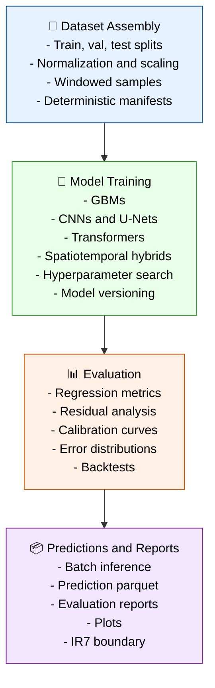

# Stage 06–07 — Modeling + Evaluation (Model-Ready Datasets → Predictions)

Stages 06 and 07 transform feature tensors (IR₅) into model‑ready datasets (IR₆), trained models, predictions, and evaluation artifacts (IR₇).
These stages follow modern, staff‑level ML engineering patterns: deterministic dataset assembly, versioned training manifests, reproducible evaluation, and artifact tracking.



---

## Responsibilities

### 1. Dataset Assembly (Stage 06)

- Build deterministic train/val/test splits.
- Normalize and scale features:
  - standardization
  - min/max scaling
  - variable‑specific normalization
- Construct windowed samples for temporal models:
  - sliding windows
  - autoregressive contexts
- Produce dataset manifests:
  - feature list
  - normalization rules
  - split definitions
  - sample counts
- Write model‑ready datasets:

```code
data/datasets/<dataset_name>.parquet
```

### 2. Model Training (Stage 06)

- Support multiple model families:
  - GBMs (XGBoost, LightGBM)
  - CNNs / U‑Nets (spatial)
  - Transformers (temporal)
  - Spatiotemporal hybrids
- Hyperparameter search:
  - grid search
  - random search
  - Bayesian optimization
- Version all model artifacts:
  - weights
  - training config
  - normalization rules
  - dataset manifest
- Write model artifacts:

```code
models/<model_id>/artifacts/
models/<model_id>/metadata.json
```

### 3. Evaluation (Stage 07)

- Compute regression metrics:
  - MAE
  - RMSE
  - R²
  - MAPE
- Residual analysis:
  - residual distributions
  - spatial residual maps
  - temporal residual curves
- Calibration curves:
  - reliability diagrams
  - error calibration
- Error distributions:
  - histograms
  - KDEs
- Backtests:
  - rolling evaluation windows
  - temporal generalization checks
- Write evaluation artifacts:

```code
evaluation_reports/<model_id>.json
plots/<model_id>_*.png
```

### 4. Predictions (Stage 07)

- Batch inference over full datasets.
- Write prediction parquet files:

```code
data/predictions/<model_id>_<timestamp>.parquet
```

- Produce final IR₇ artifacts.

---

## Outputs

### Model-Ready Datasets (IR₆)

```code
data/datasets/<dataset_name>.parquet
```

### Model Artifacts (IR₆)

```code
models/<model_id>/artifacts/
models/<model_id>/metadata.json
```

### Predictions (IR₇)

```code
data/predictions/<model_id>_<timestamp>.parquet
```

### Evaluation Reports (IR₇)

```code
evaluation_reports/<model_id>.json
```

### Plots (IR₇)

```code
plots/<model_id>_*.png
```

### IR Boundary

- Defines **IR₆** (model‑ready datasets + model artifacts)
- Defines **IR₇** (predictions + evaluation artifacts)
