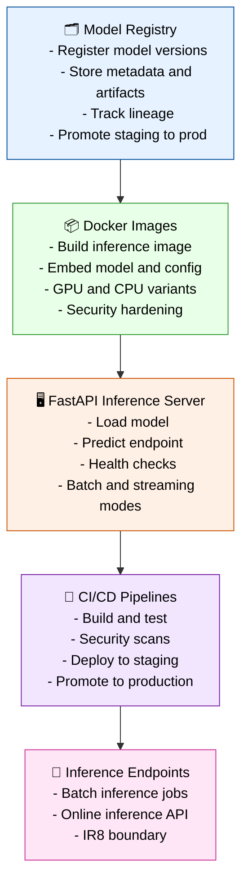

# Stage 08 — Deployment (Registry → Docker → API → CI/CD)

Stage 08 operationalizes trained models (IR₆) and evaluation artifacts (IR₇) into production‑ready deployment assets (IR₈).
This stage follows modern ML‑infra patterns: model registry integration, containerized inference, API serving, and CI/CD automation.



---

## Responsibilities

### 1. Model Registry

- Register trained models from Stage 06.
- Store:
  - model weights
  - training config
  - dataset manifest
  - normalization rules
  - evaluation summary
- Track lineage:
  - parent dataset
  - feature version
  - training code version
- Support promotion workflow:
  - staging → production

### 2. Docker Images

- Build containerized inference images.
- Embed:
  - model artifacts
  - normalization rules
  - inference config
- Produce CPU and GPU variants.
- Apply security hardening:
  - minimal base images
  - pinned dependencies
  - vulnerability scans

### 3. FastAPI Inference Server

- Load model + normalization rules at startup.
- Provide endpoints:
  - `/predict`
  - `/health`
  - `/metadata`
- Support batch inference and streaming modes.
- Log requests and inference latency.
- Export Prometheus metrics.

### 4. CI/CD Pipelines

- Build and test inference images.
- Run security scans.
- Deploy to staging environment.
- Run smoke tests.
- Promote to production.
- Tag and version all deployment artifacts.

### 5. Inference Endpoints

- Batch inference jobs:
  - scheduled runs
  - large‑scale predictions
- Online inference API:
  - low‑latency predictions
  - autoscaling
- Produce final IR₈ artifacts.

---

## Outputs

### Deployment Directory (IR₈)

```code
deployment/
```

### Docker Images (IR₈)

```code
docker/<model_id>/
```

### FastAPI Server (IR₈)

```code
api/
```

### Model Registry Entries (IR₈)

```code
mlflow/<model_id>/
```

### CI/CD Manifests (IR₈)

```code
infra/
```

### IR Boundary

- Defines **IR₈** (production‑ready deployment artifacts)
